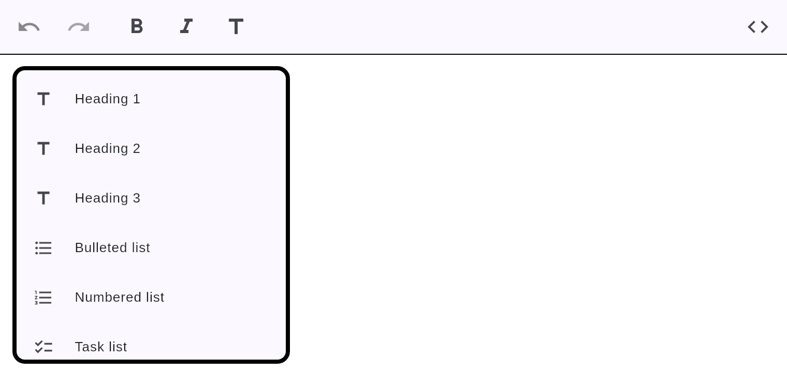

# Slash command menu

Type `/` at the start of an empty paragraph to open a filterable command menu, then keep
typing to filter and click an item to insert that block.

## Commands

Heading 1/2/3, Bulleted list, Numbered list, Task list, Quote, Code block, Divider.

## Behavior

- The menu opens only on a real `/` keystroke in a paragraph; typing a query (e.g. `/head`)
  filters the items.
- Selecting an item removes the `/query` text and converts the block.
- **Escape** dismisses the menu (and the `/` stays as literal text).

The command set is extensible via the `slashItems` parameter of `MarkdownEditor`.
