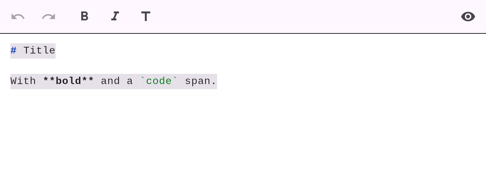

# Source mode

Toggle between the rich (WYSIWYG) view and the raw **Markdown source** at any time using the
toolbar's code button. Markdown is always the source of truth, so nothing is lost in either
direction.



The source view is a real editor with **native Markdown syntax highlighting** (headings,
emphasis, highlight, code, links, list/quote/callout markers) — no WebView or JavaScript.

Your **caret position is preserved** across the toggle: switching to source drops the cursor
at the matching place in the raw text, and switching back returns it to the matching block and
offset.

```dart
controller.toggleMode();          // switch modes
controller.mode;                  // EditorMode.wysiwyg | EditorMode.source
controller.markdown;              // the current Markdown (either mode)
```
