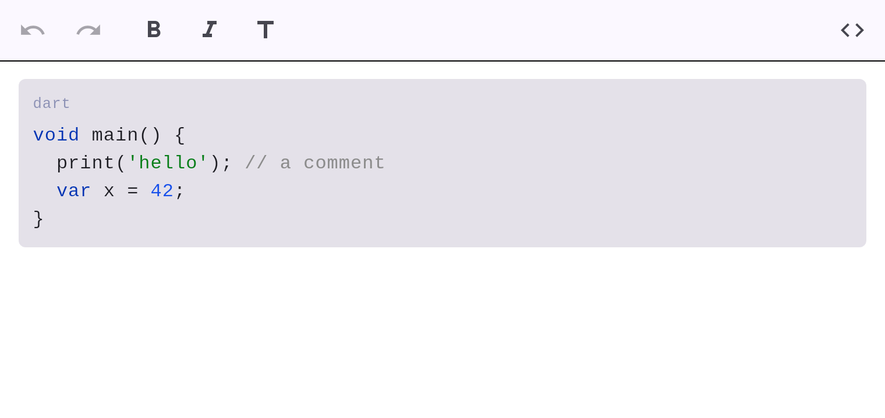

# Code blocks

Fenced code blocks with **native syntax highlighting** (pure Dart — no WebView/JS).



## How to create one

- **Slash menu:** type `/` → *Code block*.
- **Paste/load Markdown:** a fenced block with a language info-string is highlighted.

## Markdown

````markdown
```dart
void main() {
  print('hello'); // a comment
}
```
````

The language after the opening fence (e.g. `dart`) selects the highlighting and is shown as a
label. Code content is literal — Markdown inside it is not parsed.
