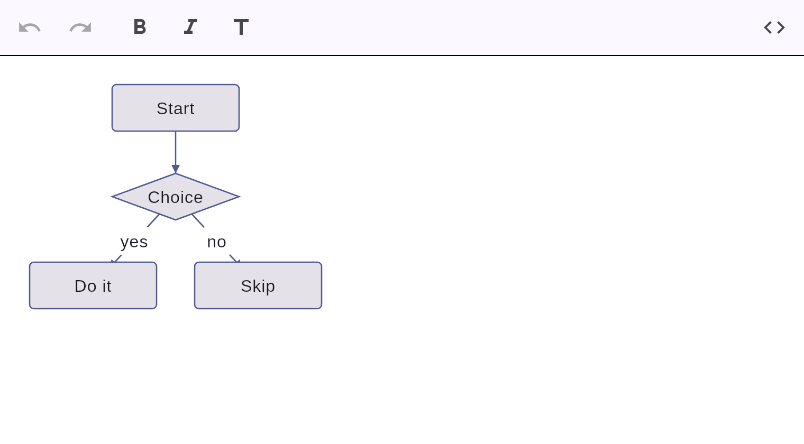
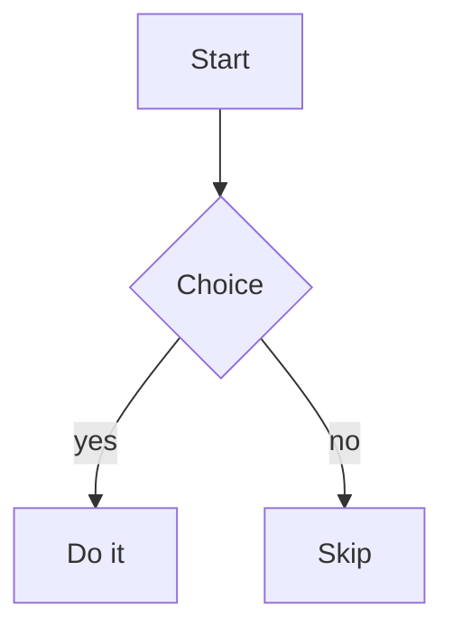
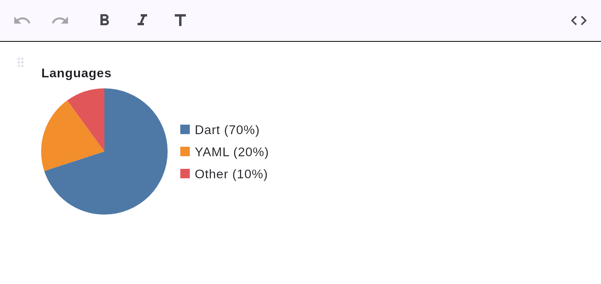
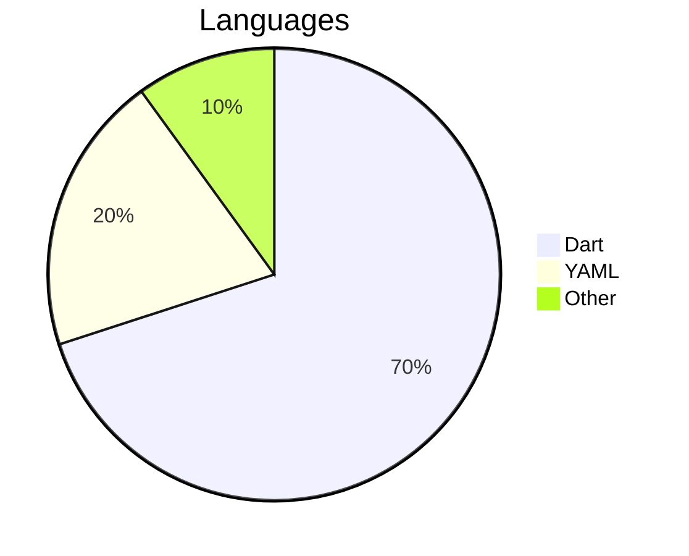
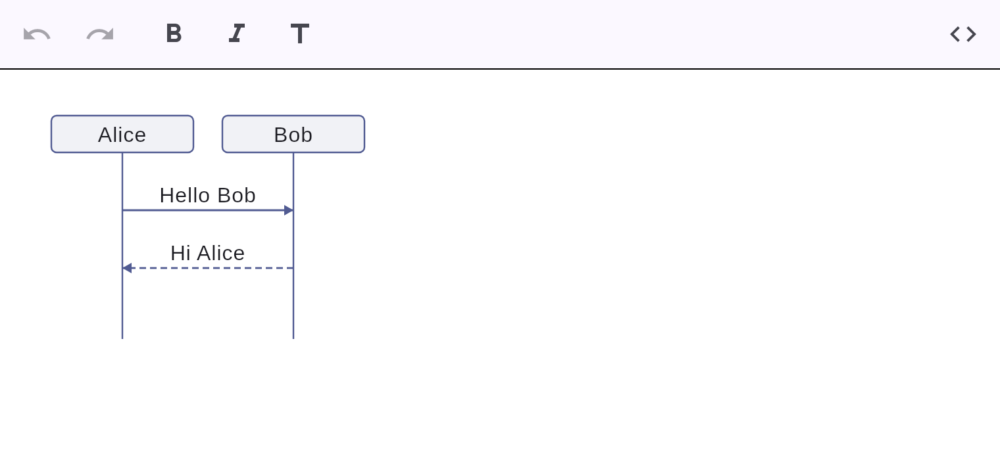
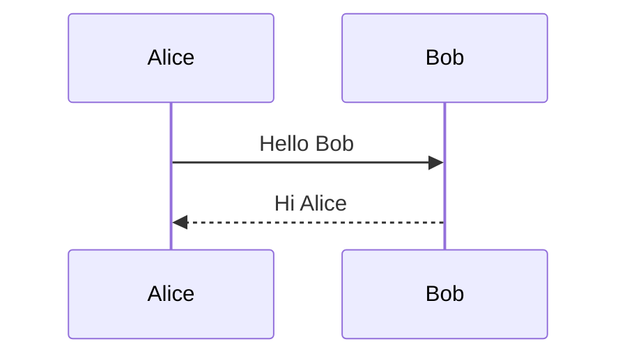
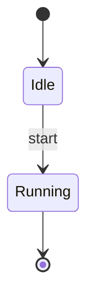
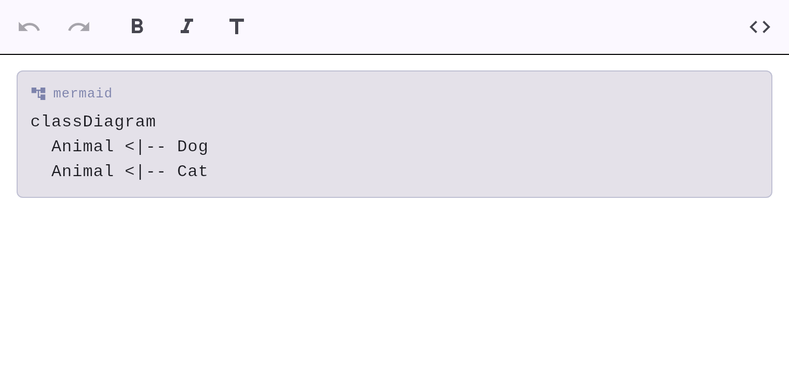

# Diagrams (Mermaid)

Mermaid diagrams are written as a ` ```mermaid ` fenced block and are a first-class node in
the document. Rendering is **100% native Dart — no WebView, no JavaScript anywhere.** A native
diagram engine renders the supported types and degrades gracefully to a readable source card
for the rest.

## Flowcharts



````markdown

````

Supports `graph`/`flowchart` with `TD`/`LR` directions, node shapes (`[rect]`, `(rounded)`,
`{diamond}`, `((circle))`), and labeled edges, laid out in layers.

## Pie charts



````markdown

````

## Sequence diagrams



````markdown

````

## State diagrams

State diagrams render natively too (reusing the flowchart layout):

````markdown

````

## Other types

Diagram types the native engine doesn't yet support (e.g. class, gantt, ER) degrade
gracefully to a readable **source card** with a `mermaid` badge:



You can also plug in your own renderer via the `diagramRenderer` parameter of
`MarkdownEditor`.
