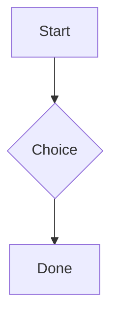
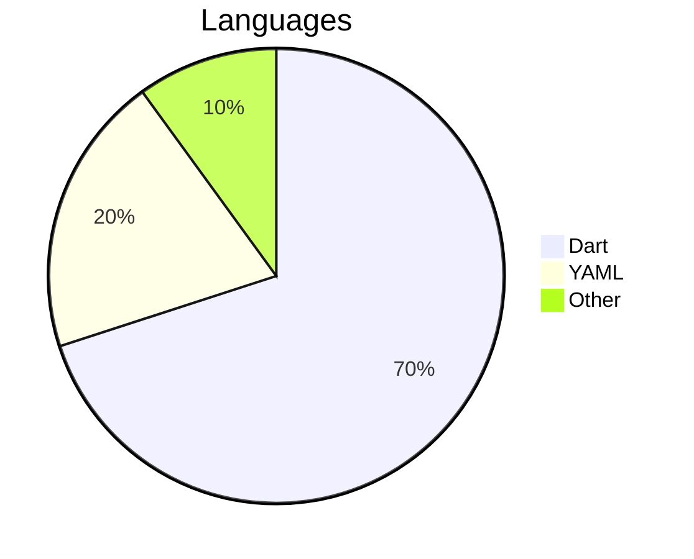
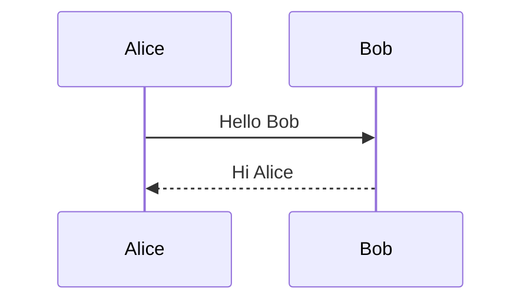

# Diagrams (Mermaid)

Mermaid diagrams are written as a ` ```mermaid ` fenced block and are a first-class node in
the document.


## Markdown

````markdown

````

## Native rendering

Rendering is **100% native** — no WebView or JavaScript anywhere. A native Dart diagram engine
is being built in stages (by diagram type). **Pie charts already render natively:**


````markdown

````

**Sequence diagrams** also render natively (lifelines, solid/dashed message arrows):


````markdown

````

Diagram types not yet implemented degrade gracefully to a readable **source card** with a
`mermaid` badge (the flowchart above). You can also plug in your own renderer via the
`diagramRenderer` parameter of `MarkdownEditor`.
