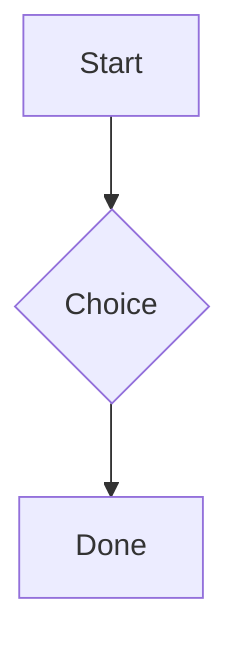

# Diagrams (Mermaid)

Mermaid diagrams are written as a ` ```mermaid ` fenced block and are a first-class node in
the document.


## Markdown

````markdown

````

## Rendering

Rendering is **100% native** — there is no WebView or JavaScript anywhere in the editor. A
native Dart diagram engine is being built in stages (by diagram type); until a given diagram
type is supported it degrades gracefully to a readable **source card** (shown above) with a
`mermaid` badge. You can also plug in your own renderer via the `diagramRenderer` parameter of
`MarkdownEditor`.
