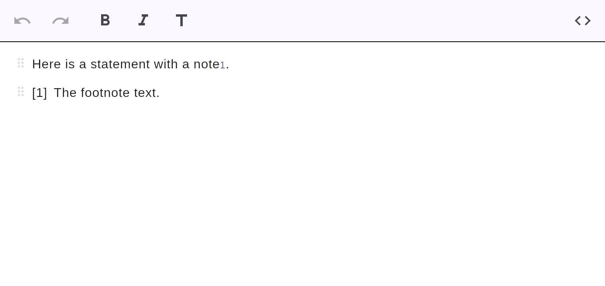

# Footnotes

Pandoc/GFM-style footnotes: an inline reference plus a definition.



## Markdown

```markdown
Here is a statement with a note[^1].

[^1]: The footnote text.
```

The inline `[^1]` reference is rendered as a small superscript link; the `[^1]: …`
definition is rendered as a labelled block. Both round-trip to clean Markdown.
