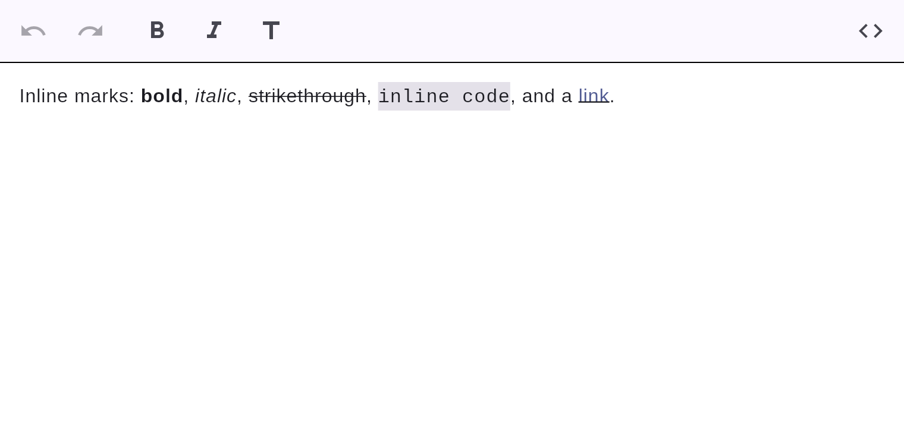

# Text formatting

Inline marks: **bold**, *italic*, ~~strikethrough~~, ==highlight==, `inline code`, and
[links](links.md).



## How to apply

- **Type Markdown:** `**bold**`, `_italic_`, `~~strike~~`, `==highlight==`, `` `code` ``
  transform in place as you type the closing delimiter (see
  [input rules](../editing/input-rules.md)).
- **Toolbar / shortcuts:** select text and press **B**/**I** or
  <kbd>Ctrl/Cmd</kbd>+<kbd>B</kbd> / <kbd>Ctrl/Cmd</kbd>+<kbd>I</kbd>
  (see [keyboard shortcuts](../editing/keyboard-shortcuts.md)).

## Markdown

```markdown
**bold**, _italic_, ~~strikethrough~~, ==highlight==, `inline code`, [a link](https://example.com)
```

`==highlight==` (also called *mark*) renders with a coloured background and exports to HTML as
`<mark>`. The highlight colour is `EditorStyle.highlightColor`, themable like every other colour.

Marks nest and combine (e.g. **bold _and italic_**), and always round-trip to canonical
Markdown.

## The selection bubble toolbar

Selecting text pops up a compact floating toolbar with **Bold**, *Italic*, ~~Strikethrough~~,
==Highlight== and `code` — tap to apply to the selection. The persistent toolbar at the top offers the same
actions plus block conversions and the source toggle.
