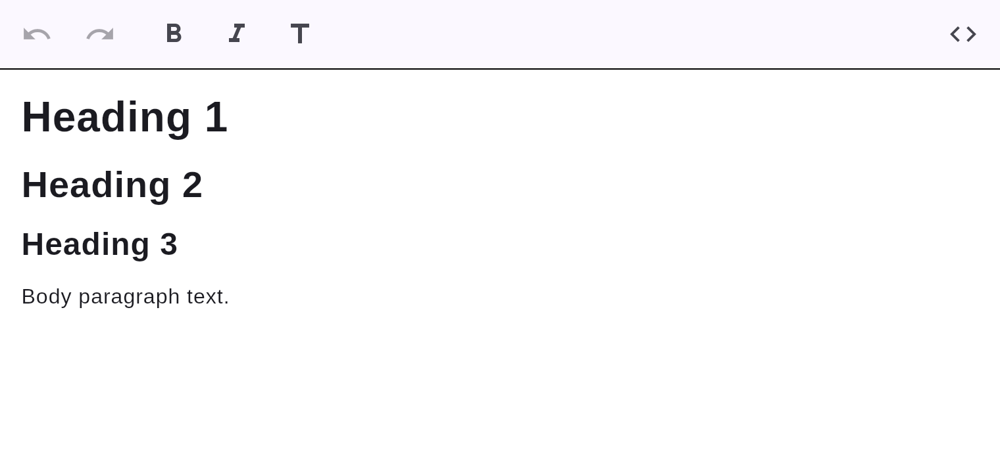

# Headings

Six heading levels, written as ATX Markdown (`#` … `######`).



## How to create one

- **Type it:** at the start of a line, type `#` followed by a space for an H1, `##␣` for H2,
  up to `######␣` for H6. The marker is consumed and the block becomes a heading
  (see [input rules](../editing/input-rules.md)).
- **Toolbar:** press the **Heading** button to turn the current block into an H1.
- **Slash menu:** type `/` and choose *Heading 1/2/3* (see [slash menu](../editing/slash-menu.md)).

## Markdown

```markdown
# Heading 1
## Heading 2
### Heading 3
```

Pressing **Backspace** immediately after the `#␣` transform reverts it to literal text.
