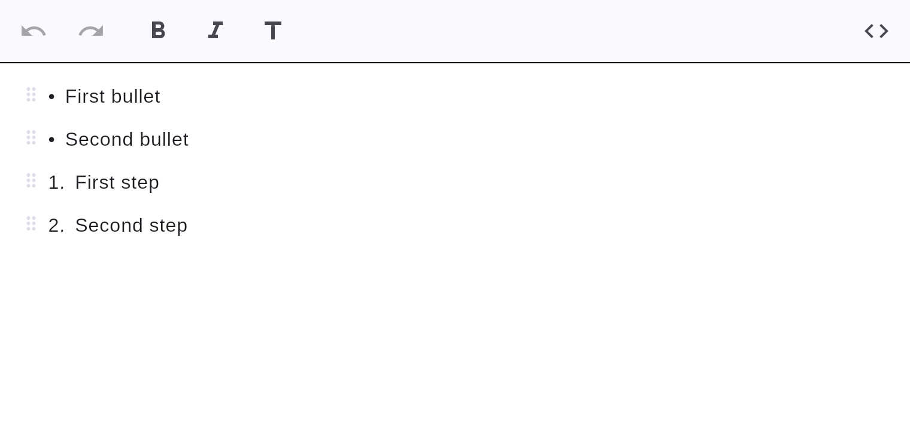

# Lists

Bulleted and numbered lists.



## How to create one

- **Type it:** `- ␣` (or `* ␣` / `+ ␣`) starts a bulleted list; `1. ␣` starts a numbered list.
- **Slash menu:** type `/` → *Bulleted list* or *Numbered list*.

## Markdown

```markdown
- First bullet
- Second bullet

1. First step
2. Second step
```

Lists nest by indentation (two spaces per level), and round-trip with their nesting.

See also [task lists](tasks.md) for checkable items.
