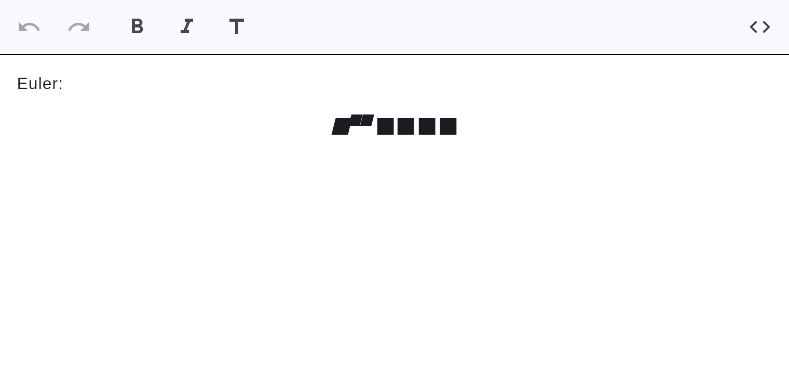

# Math

KaTeX-class **block math**, rendered natively (no JavaScript) via `flutter_math_fork`.



## How to create one

- **Slash menu / source:** wrap LaTeX in `$$` fences on their own lines.

## Markdown

```markdown
$$
e^{i\pi} + 1 = 0
$$
```

!!! note
    Rendering is KaTeX-class — it covers the vast majority of math. Exotic LaTeX that KaTeX
    doesn't support falls back to a readable source card (there is no JavaScript fallback by
    design). See the project's feature-feasibility notes.
