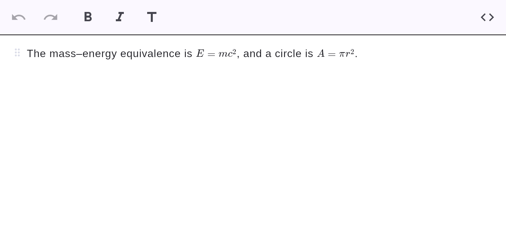

# Math

KaTeX-class math, rendered **natively** (no JavaScript) via `flutter_math_fork` — both block
and inline.

## Block math


Wrap LaTeX in `$$` fences on their own lines:

```markdown
$$
e^{i\pi} + 1 = 0
$$
```

## Inline math



Wrap LaTeX in single `$…$` within a line. It renders natively inline when you're not editing
the line; click into the line to edit the LaTeX source.

```markdown
The mass–energy equivalence is $E = mc^2$.
```

!!! note
    Rendering is KaTeX-class — it covers the vast majority of math. Exotic LaTeX that KaTeX
    doesn't support falls back to a readable source card (there is no JavaScript fallback by
    design). See the project's feature-feasibility notes.
