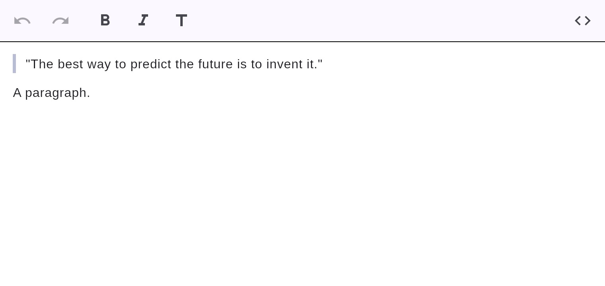

# Block quotes



Quotes nest: `> > inner` becomes a quote within a quote.

## How to create one

- **Type it:** `> ␣` at the start of a line.
- **Slash menu:** type `/` → *Quote*.

## Markdown

```markdown
> "The best way to predict the future is to invent it."
```
