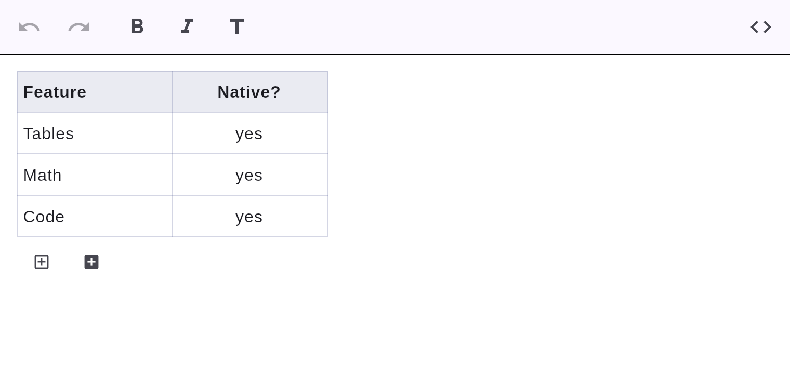

# Tables

GitHub-flavored tables with per-column alignment, rendered natively.



## Markdown

```markdown
| Feature | Native? |
| :--     | :-:     |
| Tables  | yes     |
| Math    | yes     |
```

The alignment row (`:--`, `:-:`, `--:`) sets left / center / right alignment per column, and
the table round-trips to clean Markdown.

## Editing

Tables are **editable in place**: click any cell to edit it, and use the add-row / add-column
buttons beneath the table to grow it. Cells accept inline Markdown (e.g. `**bold**`, `[links](…)`), so formatting round-trips. Every edit is undoable and reflected in the Markdown.

## Cell navigation

Press <kbd>Tab</kbd> to move the caret to the next cell (wrapping to the next
row), and <kbd>Shift</kbd>+<kbd>Tab</kbd> to move back. <kbd>Tab</kbd> from the
last cell appends a new row and lands in its first cell. Outside a table,
<kbd>Tab</kbd> falls through to normal focus traversal.

## Rectangular cell selection

Click a cell, then <kbd>Shift</kbd>+click another to select the **rectangle** of
cells between them (the range is highlighted). Copying a cell-range selection
yields tab-separated values (TSV), so it pastes straight into a spreadsheet.
