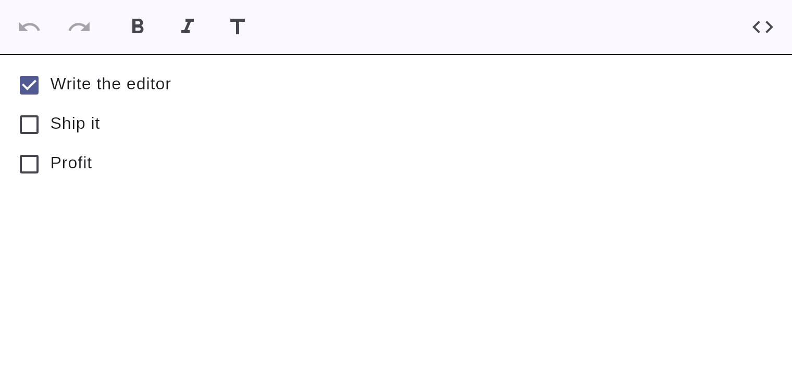

# Task lists

Checkable to-do items (GitHub-flavored task lists).



## How to create one

- **Type it:** `[] ␣` (or `[x] ␣` for a checked item) at the start of a line.
- **Slash menu:** type `/` → *Task list*.
- **Toggle:** tap the checkbox to check/uncheck — it's a normal, undoable edit.

## Markdown

```markdown
- [x] Write the editor
- [ ] Ship it
```
