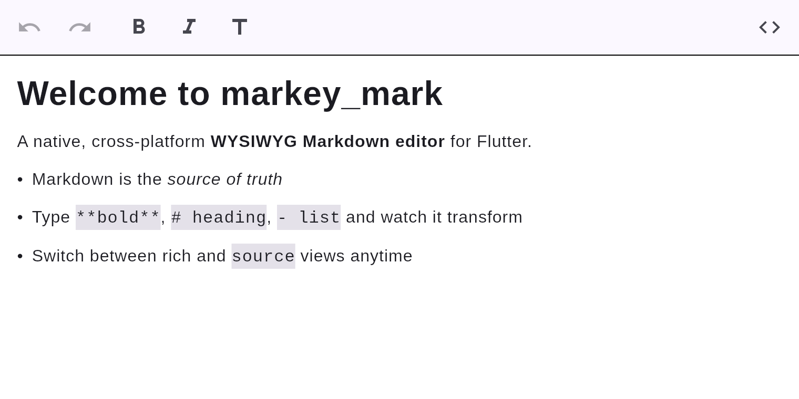

# markey_mark

A from-scratch, **fully native, cross-platform WYSIWYG Markdown editor** for Flutter —
Google-Docs feel, **Markdown as the source of truth**, and a fluid switch between rich
(WYSIWYG) and raw (source) modes. **No WebView, no JavaScript — 100% native Flutter**, so it
runs on iOS, Android, web, Windows, macOS, and Linux from one codebase.



## Why markey_mark

- **Markdown is the source of truth.** What you edit always round-trips to clean Markdown.
- **It feels modern.** Live formatting as you type, a slash (`/`) command menu, a formatting
  toolbar, and a one-tap switch to raw Markdown source.
- **It's 100% native.** Math, code highlighting, tables, and diagrams render in pure Flutter —
  nothing is hosted in a browser.
- **It runs everywhere Flutter does**, with the same behavior.

## Explore the features

| | |
|---|---|
| [Headings](features/headings.md) | `#`–`######`, six levels |
| [Text formatting](features/formatting.md) | bold, italic, strikethrough, code, links |
| [Lists](features/lists.md) | bulleted & numbered |
| [Task lists](features/tasks.md) | checkable to-do items |
| [Block quotes](features/quotes.md) | `>` quotes |
| [Code blocks](features/code-blocks.md) | fenced code with native syntax highlighting |
| [Math](features/math.md) | KaTeX-class `$$…$$` block math, native |
| [Images](features/images.md) | inline images |
| [Markdown input rules](editing/input-rules.md) | live "magic" transforms as you type |
| [Slash command menu](editing/slash-menu.md) | `/` to insert any block |
| [Source mode](editing/source-mode.md) | edit raw Markdown with highlighting |

## Quick start

```dart
import 'package:flutter/material.dart';
import 'package:markey_mark/markey_mark.dart';

final controller = MarkdownEditorController(markdown: '# Hello\n\nStart typing…');

// ...
MarkdownEditor(controller: controller);
```

See [Getting started](getting-started.md) for a complete example.

---

This documentation is generated from the project's `docs/` folder and published with MkDocs;
screenshots are produced by a test that drives the real editor. See
[Contributing docs](contributing-docs.md).
